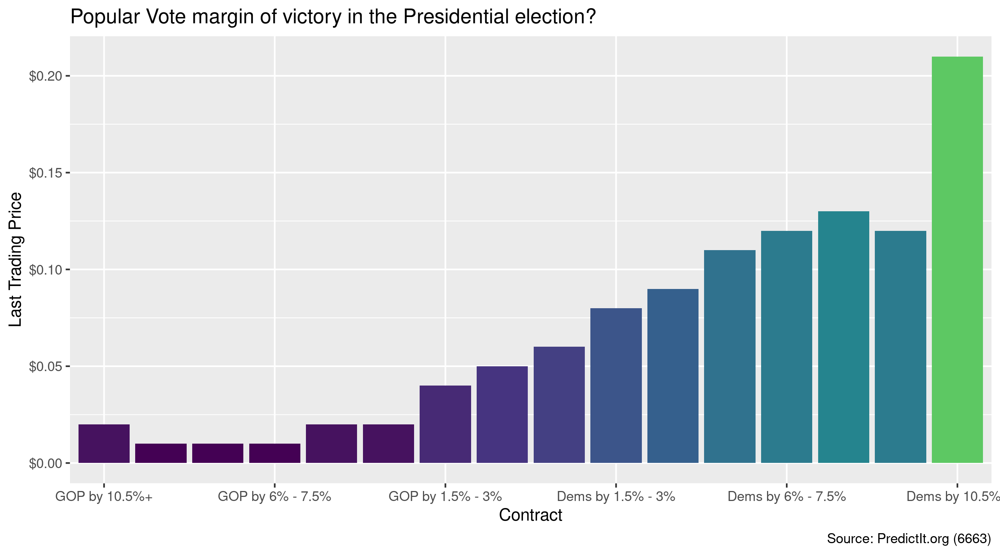
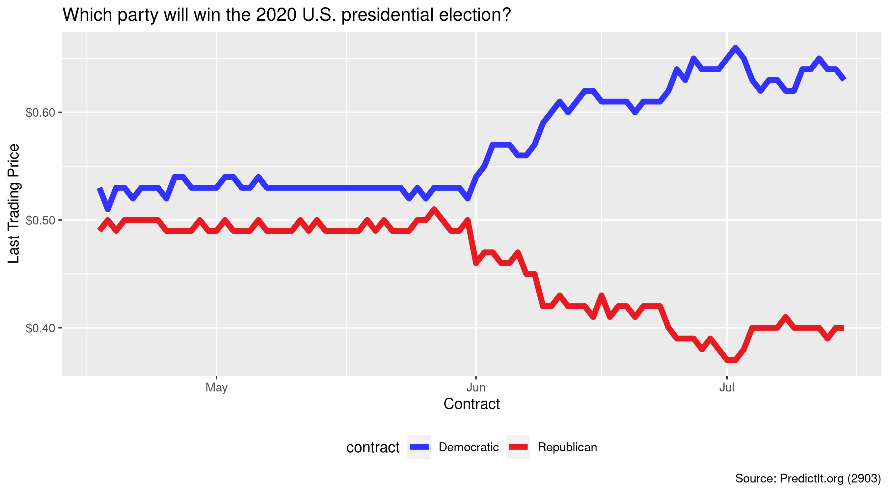

<!-- README.md is generated from README.Rmd. Please edit that file -->

# predictr <a href='https://kiernann.com/predictr'></a>

<!-- badges: start -->

[](https://www.tidyverse.org/lifecycle/#experimental)
[](https://CRAN.R-project.org/package=predictr)
[](https://travis-ci.org/kiernann/predictr)
[](https://codecov.io/gh/kiernann/predictr?branch=master)
<!-- badges: end -->

The goal of predictr is to access the
[PredictIt](https://www.predictit.org/) API and determine the price of
binary futures contracts trading on the prediction market. Data is
returned as tidy tibbles, with unique rows for contract prices at a
given point in time.

## Markets

[Prediction markets](https://en.wikipedia.org/wiki/Prediction_market)
demonstrate the [efficient market
hypothesis](https://en.wikipedia.org/wiki/Efficient-market_hypothesis),
which states that market prices reflect *all* available information.
Self-interested traders buy and sell contracts tied to a binary outcome.
These contracts expire for $1 or $0, depending on the outcome.

The more likely an outcome is, the higher the price and the lower the
payout. As the probability of an outcome changes, traders buy or sell at
new prices and the equilibrium price updates to reflect the new
probability.

## Installation

You can install the development version from
[GitHub](https://github.com/kiernann/predictr) with:

``` r
# install.packages("devtools")
devtools::install_github("kiernann/predictr")
```

## Usage

The `open_markets()` function lists all active markets.

``` r
library(predictr)
library(tidyverse)
all_markets <- open_markets(split = FALSE)
```

Use `market_price()` to get the *current* price of a market’s contracts.

``` r
# Electoral College margin of victory?
market_price(6653)[-3]
#> # A tibble: 16 x 7
#>    time                  mid   cid contract           last close end                
#>    <dttm>              <int> <int> <fct>             <dbl> <dbl> <dttm>             
#>  1 2020-07-16 13:10:47  6653 22320 GOP by 280+        0.02  0.03 NA                 
#>  2 2020-07-16 13:10:47  6653 22347 GOP by 210 - 279   0.02  0.02 NA                 
#>  3 2020-07-16 13:10:47  6653 22345 GOP by 150 - 209   0.04  0.04 NA                 
#>  4 2020-07-16 13:10:47  6653 22325 GOP by 100 - 149   0.05  0.05 NA                 
#>  5 2020-07-16 13:10:47  6653 22319 GOP by 60 - 99     0.06  0.07 NA                 
#>  6 2020-07-16 13:10:47  6653 22317 GOP by 30 -59      0.06  0.06 NA                 
#>  7 2020-07-16 13:10:47  6653 22316 GOP by 10 - 29     0.06  0.06 NA                 
#>  8 2020-07-16 13:10:47  6653 22315 GOP by 0 - 9       0.06  0.06 NA                 
#>  9 2020-07-16 13:10:47  6653 22321 Dems by 1 - 9      0.03  0.03 NA                 
#> 10 2020-07-16 13:10:47  6653 22322 Dems by 10 - 29    0.04  0.04 NA                 
#> 11 2020-07-16 13:10:47  6653 22323 Dems by 30 -59     0.07  0.06 NA                 
#> 12 2020-07-16 13:10:47  6653 22318 Dems by 60 - 99    0.09  0.09 NA                 
#> 13 2020-07-16 13:10:47  6653 22326 Dems by 100 - 149  0.12  0.12 NA                 
#> 14 2020-07-16 13:10:47  6653 22346 Dems by 150 - 209  0.15  0.14 NA                 
#> 15 2020-07-16 13:10:47  6653 22348 Dems by 210 - 279  0.14  0.13 NA                 
#> 16 2020-07-16 13:10:47  6653 22324 Dems by 280+       0.17  0.16 NA
```



Using `market_history()` can return 24 hours or 90 days of price
history.



<!-- refs: start -->

<!-- refs: end -->
