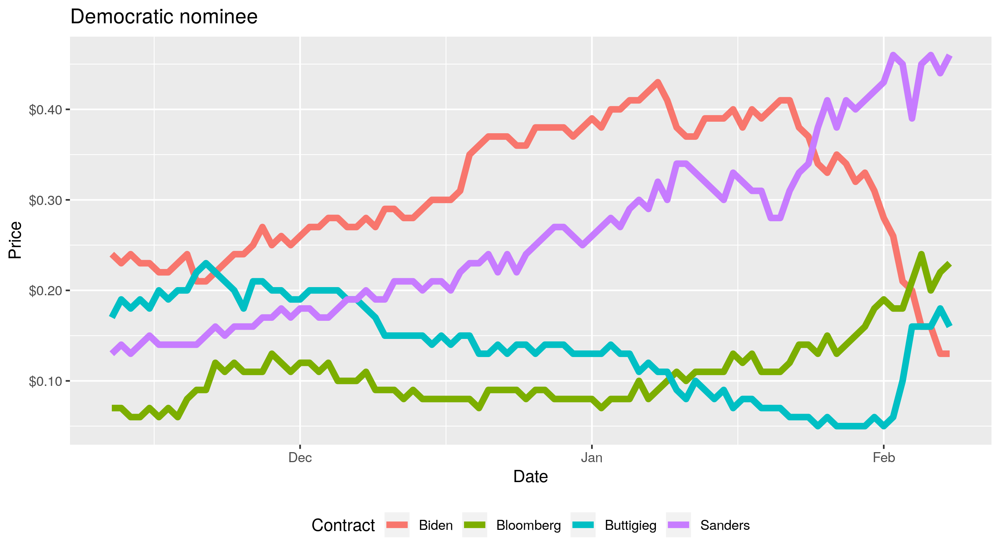
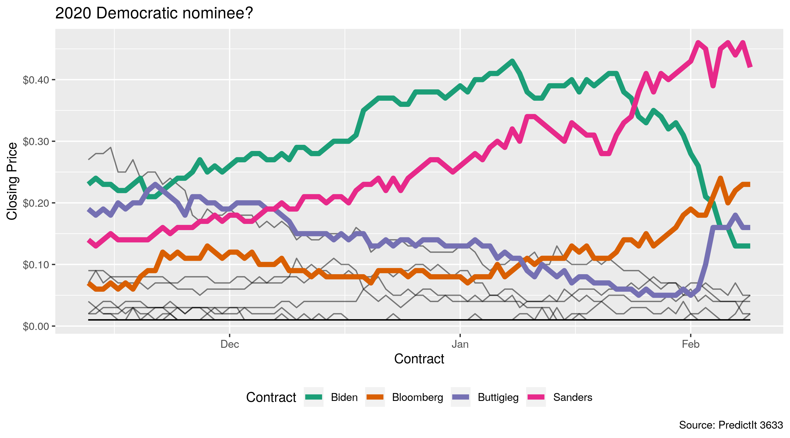

<!-- README.md is generated from README.Rmd. Please edit that file -->

# predictr <a href='https://kiernann.com/predictr'></a>

<!-- badges: start -->

[](https://www.tidyverse.org/lifecycle/#experimental)
[](https://CRAN.R-project.org/package=predictr)
[](https://travis-ci.org/kiernann/predictr)
[](https://codecov.io/gh/kiernann/predictr?branch=master)
<!-- badges: end -->

The goal of predictr is to access the
[PredictIt](https://www.predictit.org/) API and determine the price of
binary futures contracts trading on the prediction market. Data is
returned as tidy tibbles, with unique rows for contract prices at a
given point in time.

## Markets

[Prediction markets](https://en.wikipedia.org/wiki/Prediction_market)
demonstrate the [efficient market
hypothesis](https://en.wikipedia.org/wiki/Efficient-market_hypothesis),
which states that market prices reflect *all* available information.
Self-interested traders buy and sell contracts tied to a binary outcome.
These contracts expire for $1 or $0, depending on the outcome.

The more likely an outcome is, the higher the price and the lower the
payout. As the probability of an outcome changes, traders buy or sell at
new prices and the equilibrium price updates to reflect the new
probability.

## Installation

You can install the development version from
[GitHub](https://github.com/kiernann/predictr) with:

``` r
# install.packages("devtools")
devtools::install_github("kiernann/predictr")
```

## Usage

``` r
library(predictr)
market_price(6403)
#> # A tibble: 9 x 7
#>   time                  mid market                      cid contract  last close
#>   <dttm>              <int> <chr>                     <int> <ord>    <dbl> <dbl>
#> 1 2020-02-10 15:41:29  6403 NH primary margin of vic… 20984 [0,4)     0.31  0.33
#> 2 2020-02-10 15:41:29  6403 NH primary margin of vic… 20988 [4,5)     0.12  0.17
#> 3 2020-02-10 15:41:29  6403 NH primary margin of vic… 20990 [5,6)     0.11  0.17
#> 4 2020-02-10 15:41:29  6403 NH primary margin of vic… 20991 [6,7)     0.11  0.14
#> 5 2020-02-10 15:41:29  6403 NH primary margin of vic… 20985 [7,8)     0.11  0.1 
#> 6 2020-02-10 15:41:29  6403 NH primary margin of vic… 20986 [8,9)     0.07  0.08
#> 7 2020-02-10 15:41:29  6403 NH primary margin of vic… 20987 [9,10)    0.08  0.06
#> 8 2020-02-10 15:41:29  6403 NH primary margin of vic… 20992 [10,11)   0.08  0.06
#> 9 2020-02-10 15:41:29  6403 NH primary margin of vic… 20989 [11,100]  0.12  0.08
```

Current and historical prices can be automatically plotted with
[ggplot2](https://github.com/tidyverse/ggplot2).

``` r
market_plot(market_history(3633), color = 4)
```



``` r
market_plot(market_price(6403))
```



<!-- refs: start -->

<!-- refs: end -->
